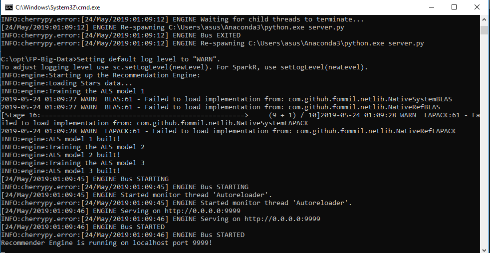
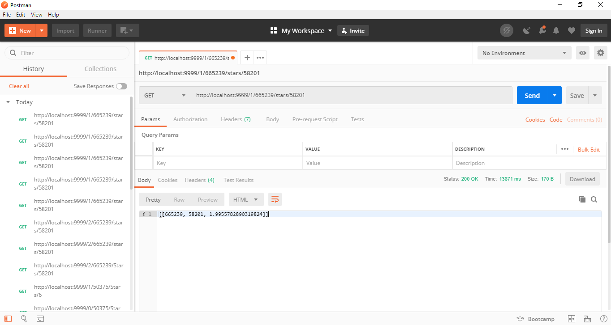
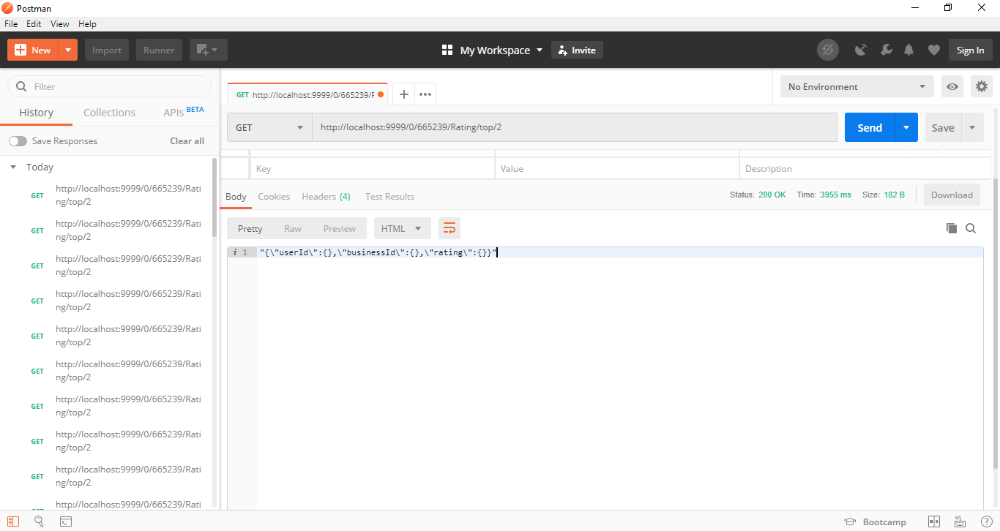
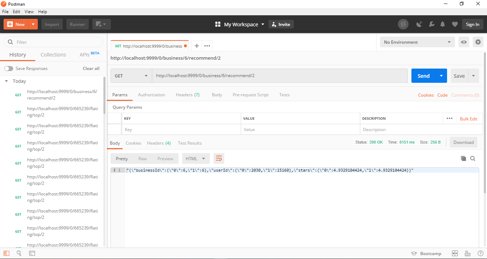

# Final Project (Big Data) - Recommendation Engine with Streaming Data Using Apache Spark, Kafka and Flash 
A Web Service based Recommendation Engine made with PySpark and Flash using Streaming Data from Apache Kafka. Using the collaborative filtering algorithm.
## Files Included 
### Apache Kafka : Streaming Data 
#### producer.py 
Send the data partially through batches to consumer. 
#### consumer.py
Receive the data from kafka server and will be used for the recommendation engine. 
### Recommendation Engine with Flask, Spark 
#### app.py 
App that define the RESTful API 
#### server.py 
Initialize a CherryPy web server for app.py and create the SparkContext for engine.py 
#### engine.py 
The Recommendation Engine system using pyspark. 
## Limitations 
### Model Used
Model 1: First 10.000 of data <br>
Model 2: Next 10.000 of data <br>
Model 3: Next 10.000 of data
### API Endpoint
The API runs on localhost (0.0.0.0) on port number 9898.
## How To Run the System 
1. Start the zkserver and kafka 
2. Make a new topic in kafka, this project use the topic of "yelpdata"
```
kafka-topics.bat --create --zookeeper localhost:2181 --replication-factor 1 --partitions 1 --topic yelpdata
```
3. Run producer.py
4. Run consumer.py
5. Wait until after the dataset is saved
6. Run server.py 

## Available API Requests
http://localhost:9999/<model_id>/<userId>/stars/<businessIid> <br>
method = [GET] <br>
Display system prediction regarding the stars (rating) for <businessId> that <userId> will give. <br>

  
http://localhost:9999/<int:model>/<int:userId>/Rating/top/<int:business_count> <br>
method = [GET] <br>
Display top int:count business that is recommended to the user <user_id> <br>


http://localhost:9999//<int:model>/business/<int:businessId>/recommend/<int:user_count> <br>
method = [GET] <br>
Display busines int : businessId that is recommended to the count of user <user_count> <br>


